# Forecasting Electricity Demand
### Ryan Blauwaert

## Motivation
For most of us, it's difficult to imagine a world in which the lights don't come on when we flip a switch. We don't often consider the source of the electricity that flows around us or its path from generation to transmission to consumption. It turns out that electricity is unlike most commodities we consume; it is costly to produce and impossible to store efficiently for future use. Because of this, it is extremely important for producers to accurately predict electricity demand. 

Forecasting allows electricity generators to:
- make informed long-term business decision such as building new power plants in response to increasing demand
- better allocate resources such as labor from plant to plant
- start and stop generators in response to anticipated demand
- adjust load transmission in response to short-term demand fluctuations

Over the last 5 years, the United States consumed an average of nearly 11 million megawatt hours each day. While the cost of electricity varies greatly, even using a conservative estimate of $50 per megawatt hour, it is easy to see that the costs of poorly forecasting demand are astronomical. 

The purpose of this study is to:
1. Analyze the short-term and long-term time features which contribute to electricty demand in the United States
2. Build and evaluate several supervised learning models in order to accurately forecast electricity demand.

## The Data
The [U.S. Energy Information Administration](https://www.eia.gov/) provides energy demand data, measured hourly, from across the United States. The data consists of only two features: hourly timestamps, and the number of megawatt hours of electricity consumed in that hour. These records span from July 1, 2015 to the retrieval date: March 21, 2021. The first few rows are displayed below, followed by some summary statistics:

| Time                | Megawatthours |
|---------------------|---------------|
| 2015-07-01 02:00:00 | 335153        |
| 2015-07-01 03:00:00 | 333837        |
| 2015-07-01 04:00:00 | 398386        |
| 2015-07-01 05:00:00 | 388954        |
| 2015-07-01 06:00:00 | 392487        |

| Statistic          | Megawatthours |
|--------------------|---------------|
| Mean               | 455202        |
| Standard Deviation | 74939         |
| Minimum Value      | 271855        |
| First Quartile     | 403708        |
| Median Value       | 443387        |
| Third Quartile     | 491278        |
| Maximum Value      | 717849        |

By graphically plotting hourly electricity demand over time, we are able to see a cyclical pattern:

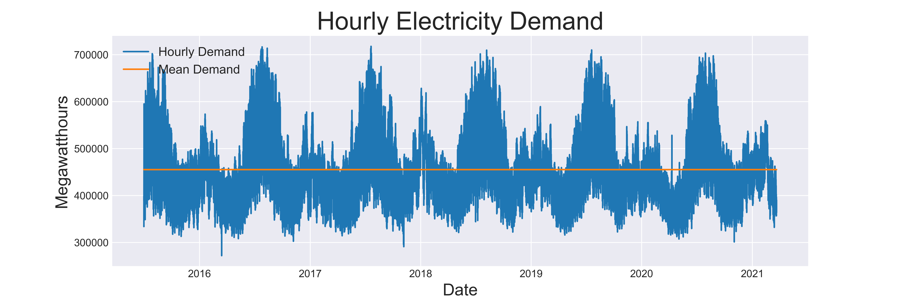

In order to better analyze the trend and seasonality of the data, I created six features from the datetime object:
1. Year
2. Month
3. Hour
4. Day of Week
5. Day of Month
6. Day of Year

An example of this featurization can be seen below:

| Time                | Megawatthours | Year | Month | Hour | Day of Week | Day of Month | Day of Year |
|---------------------|---------------|------|-------|------|-------------|--------------|-------------|
| 2015-07-01 02:00:00 | 335153        | 2015 | 7     | 2    | 2           | 1            | 182         |
| 2015-07-01 03:00:00 | 333837        | 2015 | 7     | 3    | 2           | 1            | 182         |
| 2015-07-01 04:00:00 | 398386        | 2015 | 7     | 4    | 2           | 1            | 182         |
| 2015-07-01 05:00:00 | 388954        | 2015 | 7     | 5    | 2           | 1            | 182         |
| 2015-07-01 06:00:00 | 392487        | 2015 | 7     | 6    | 2           | 1            | 182         |

Using these additional features, I was able to decompose the data and aggregate mean demand over various time features. First, I aggregated demand into quarterly means to visualize seasonality. The graph below shows the cyclical nature of the data as demand peaks in the summer and falls to a minimum in the spring.

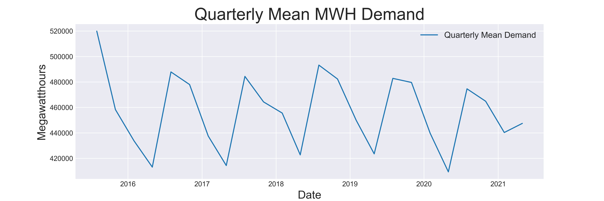

However, this seems an oversimplification of the trend based on the visualization of the full data set. What was not captured in quarterly demand is a smaller peak each winter. Below, in a graph of demand aggregated by week, we are able to see the pattern of two peaks each year, summer and winter, with lower aggregate demand each spring and fall. 
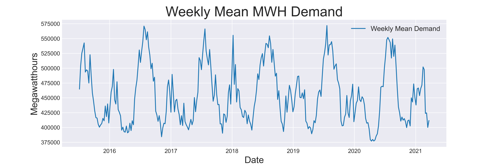

To further inspect this trend, refer to the distributions of energy demand for each month:
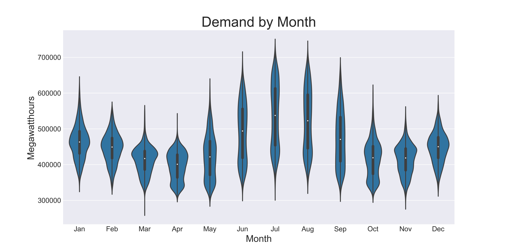
Here we can see a rise in demand starting in May, peaking in July and August, and falling demand in October and November. Intuitively, this makes sense given that consumers are using more energy to cool their homes in the summer and heat them in the winter months. 

The annual seasonality described above does not, however, explain all of the variance in total electricity demand. Below is a subset of data showing demand in July, 2017. This graph clearly shows a highly variable daily cycle of demand. 

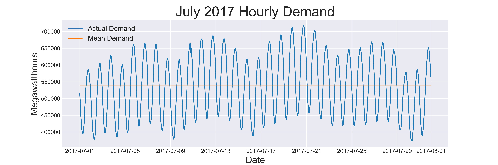

Below, we can see the distributions of electricity demand in each hour of the day. Electricity demand follows a daily cycle, peaking in the afternoon and into the evening and reaching a minimum in the early morning hours. 

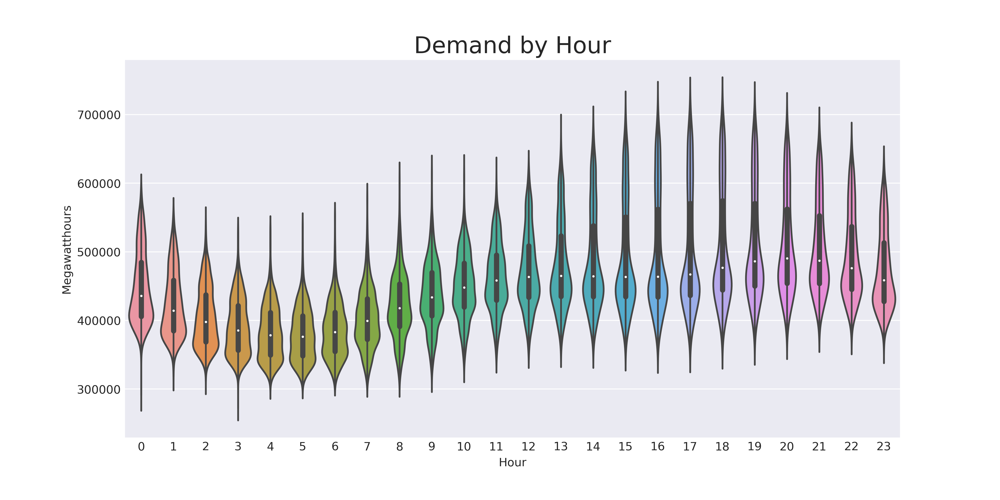

Additionally, we can see that electricity demand dips slightly on Saturday and Sunday as many workplaces are empty and therefore using less electricity.

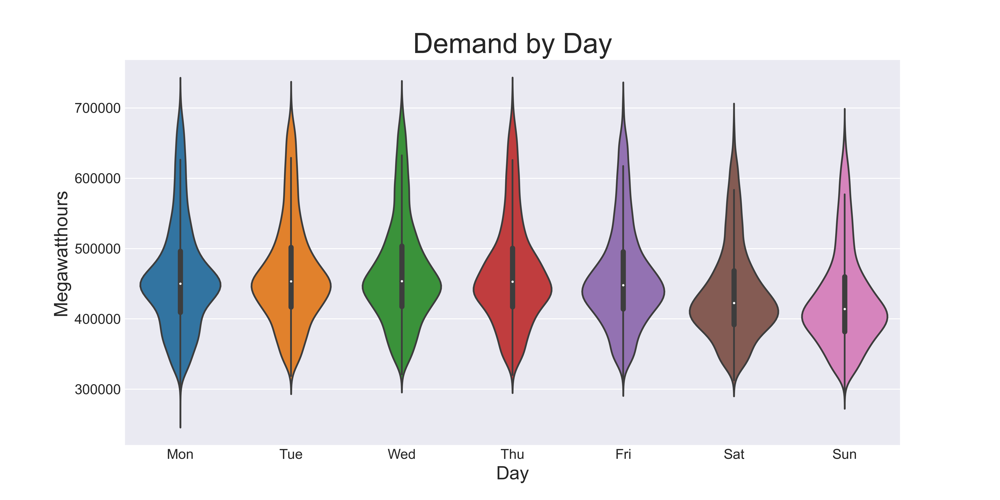

Finally, the long-term trend in energy demand can be seen in the figure below. The trend line used here was created using third order polynomial regression. While there appears to be a very slight dip late in 2016 into early 2017, there is little reason to believe that there is any significant negative or positive trend in energy demand based on the available data. 
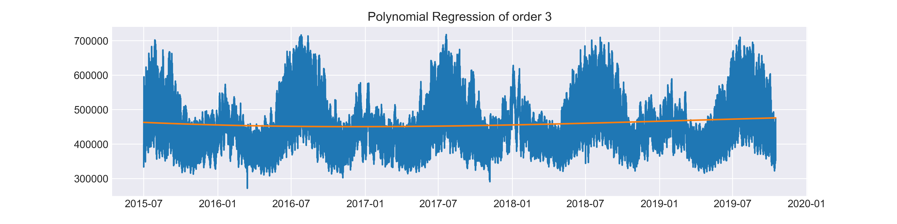

## Model Selection and Evaluation

Having gained a better understanding of the cyclical nature of electricity demand, the next challenge was to accurately forecast future demand. To do so, I first decided on a metric by which to evaluate predictions made by any model. Mean Absolute Percent Error (MAPE) will equally measure the error of predictions both above and below actual demand and is easily interpretable when working with large numbers. As a point of comparison, I first calculated the MAPE of predicting the mean electricity demand for all hours: `MAPE = 19.3%`

To improve on this baseline score, I used three supervised learning models:

1. Random Forest
2. Gradient Boosting using XGBoost
3. Recurrent Neural Network

Preliminary modeling and tuning quickly showed that an untuned XGBoost model outperformed the tuned Random Forest model and therefore the Random Forest model was abandoned relatively early in the process. 

### XGBoost

The training data used for the XGBoost model was the same data featurized with time variables (Year, Month, Hour, Day of Week, Day of Month, Day of Year) described above. This model was fit using a Random Search followed by a Grid Search and trained using a 5-fold TimeSeries split cross validation technique to preserve the sequential nature of the data. The resulting model was then tested against a previously unseen hold-out set ranging from March 1, 2020 to March 21, 2021. The predictions from this model can be seen below in orange overlayed on the actual demand measurements in blue.  

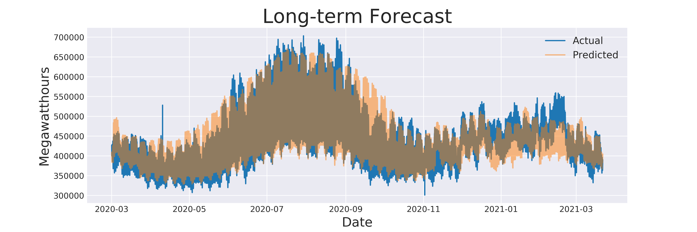

This model successfully captures the annual seasonality of electricity demand as well as its daily cyclical trend. However, it struggles to predict the magnitude of the daily peaks and valleys. This model's predictions are a significant improvement over our baseline, with a MAPE score of `5.0%`. Below are the relative feature importances found by the XGBoost model:

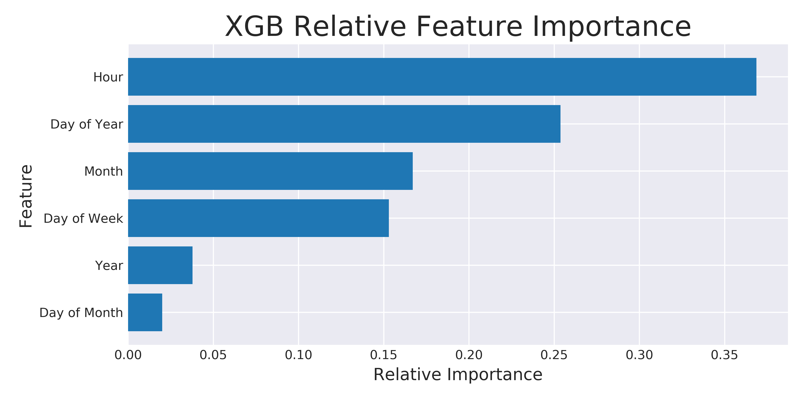

### Autoregressive Recurrent Neural Network

In an attempt to improve on the results from the XGBoost model described above, I used a recurrent neural network to forecast hourly energy demand. For this method, I featurized the data using a lag methodology. Below is a sample of the data used in this method. Each feature, n-24 through n-1 is a demand metric corresponding to the 24 hours prior to the target variable. In this way, the model will predict based on the hours leading up to the target.  

| Time                | n-24   | n-23   | ... | n-2    | n-1    | Megawatthours |
|---------------------|--------|--------|-----|--------|--------|---------------|
| 2015-07-01 02:00:00 | 335153 | 333837 | ... | 485722 | 453284 | 429199        |
| 2015-07-01 03:00:00 | 333837 | 398386 | ... | 453284 | 429199 | 407007        |
| 2015-07-01 04:00:00 | 398386 | 388954 | ... | 429199 | 407007 | 395194        |
| 2015-07-01 05:00:00 | 388954 | 392487 | ... | 407007 | 395194 | 387654        |
| 2015-07-01 06:00:00 | 392487 | 404647 | ... | 395194 | 387654 | 390157        |

By shifting the window of feature variables (increasing the time between the feature variables and the target), we can create predictions at varying points in the future. First, I used this method to predict demand 1 hour into the future. The results can be seen below:

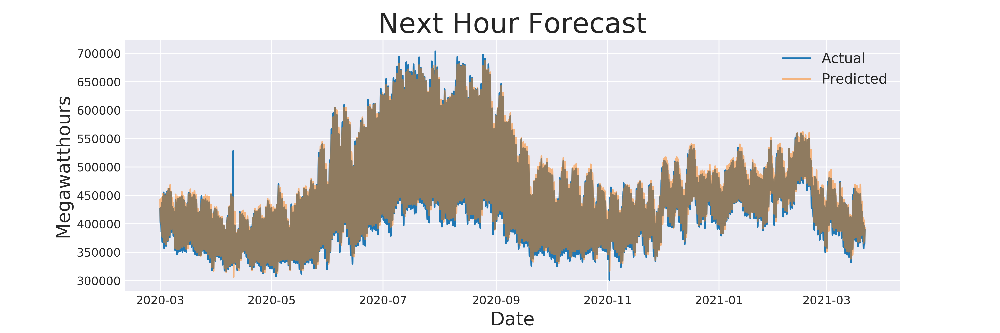

This model very accurately predicts hourly demand based on the previous 24 hours, with a MAPE score of `1.9%`. However, given the short lead time of the predictions, the usefulness of this model is limited. 

Below, a similar approach was taken to predict electricity demand 24 hours in advance.
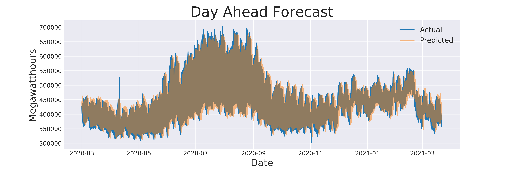
After sliding the feature window 24 hours earlier, the model still performed quite well, with a MAPE score of `3.9%`. 

Finally, I retrained the model to predict hourly demand based on 24 measurements from one year in the past, again by sliding the feature window. The results can be seen below:

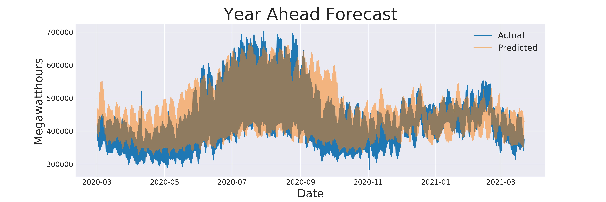

While the model forecast the annual seasonality reasonably well, it does a poor job of predicting on an hourly basis. Its MAPE score of `8.9%` makes it a worse predictor than the XGBoost model when forecasting at this range. 

## Conclusions

The figure below summarizes the results of the various models tested in this analysis:

| Model                      | Mean Absolute % Error | Use Case                                           |
|----------------------------|-----------------------|----------------------------------------------------|
| 5 Year Mean Prediction     | 19.3%                 | None - Outperformed by all models tested           |
| Time Feature XGBoost       | 5.0%                  | Long-term trend forecasting                        |
| 24-Hour Lag RNN            | 1.9%                  | Very short-term transmission adjustment            |
| 24-Hour Lag Day-Ahead RNN  | 3.9%                  | Short-term operating and transmission decisions    |
| 24-Hour Lag Year-Ahead RNN | 8.5%                  | None - XGBoost performs better for this time frame |
---
Based on these results, the model used to forecast hourly electricity demand is highly dependent on the time frame of interest. The Autoregressive RNN outperforms the XGBoost model for short-term forecasting, and can be used to assist in decisions regarding electricity transmission. For longer-term forecasting, the XGBoost model is superior, and is therefore better suited for informing decisions regarding resource allocation. 

## Directions for Further Research

1. Incorporation of weather data to capture short-term fluctuations in demand
2. Incorporation of additional historical data to assess long-term electricity demand trends
3. Similar analysis and modeling of regional energy production and demand
4. Incorporation of real-time energy demand updates from the EIA website