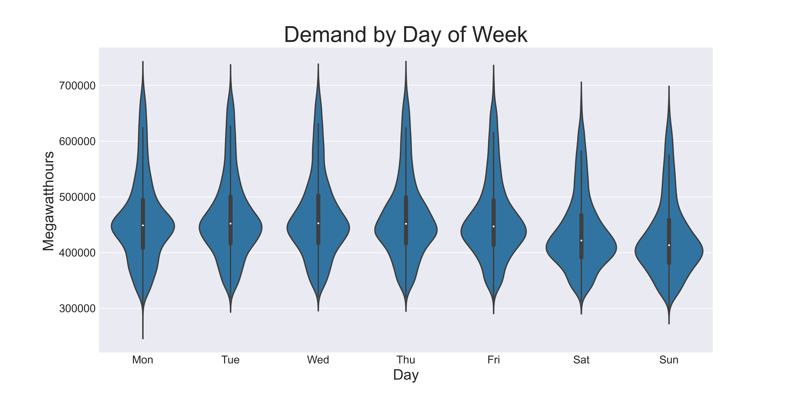

# Forecasting Electricity Demand
### Ryan Blauwaert

## Motivation
For most of us, it's difficult to imagine a world in which the lights don't come on when we flip a switch. We don't often consider the source of the electricity that flows around us or its path from generation to transmission to consumption. It turns out that electricity is unlike most commodities we consume; it is costly to produce and impossible to store efficiently for future use. Because of this, it is extremely important for producers to accurately predict electricity demand. 

Forecasting allows electricity generators to:
- make informed long-term business decision such as building new power plants in response to increasing demand
- better allocate resources such as labor from plant to plant
- start and stop generators in response to anticipated demand
- adjust load transmission in response to short-term demand fluctuations

Over the last 5 years, the United States consumed an average of nearly 11 million megawatt hours each day. While the cost of electricity varies greatly, even using a conservative estimate of $50 per megawatt hour, it is easy to see that the costs of poorly forecasting demand are astronomical. 

The purpose of this study is to:
1. Analyze the short-term and long-term time features which contribute to electricty demand in the United States
2. To build and evaluate several supervised learning models in order to accurately forecast energy demand.

## The Data
The [U.S. Energy Information Administration](https://www.eia.gov/) provides hourly energy demand data, measured hourly, from across the United States. The data consists of only two features: hourly timestamps, and the number of megawatt hours of electricity consumed in that hour. These records span from July 1, 2015 to the retrieval date: March 21, 2021. The first few rows are displayed below, followed by some summary statistics:

| Time                | Megawatthours |
|---------------------|---------------|
| 2015-07-01 02:00:00 | 335153        |
| 2015-07-01 03:00:00 | 333837        |
| 2015-07-01 04:00:00 | 398386        |
| 2015-07-01 05:00:00 | 388954        |
| 2015-07-01 06:00:00 | 392487        |
---

| Statistic          | Megawatthours |
|--------------------|---------------|
| Mean               | 455202        |
| Standard Deviation | 74939         |
| Minimum Value      | 271855        |
| First Quartile     | 403708        |
| Median Value       | 443387        |
| Third Quartile     | 491278        |
| Maximum Value      | 717849        |
---
By graphically plotting hourly electricity demand over time, we are able to see a cyclical pattern:

| Time                | Megawatthours | Year | Month | Hour | Day of Week | Day of Month | Day of Year |
|---------------------|---------------|------|-------|------|-------------|--------------|-------------|
| 2015-07-01 02:00:00 | 335153        | 2015 | 7     | 2    | 2           | 1            | 182         |
| 2015-07-01 03:00:00 | 333837        | 2015 | 7     | 3    | 2           | 1            | 182         |
| 2015-07-01 04:00:00 | 398386        | 2015 | 7     | 4    | 2           | 1            | 182         |
| 2015-07-01 05:00:00 | 388954        | 2015 | 7     | 5    | 2           | 1            | 182         |
| 2015-07-01 06:00:00 | 392487        | 2015 | 7     | 6    | 2           | 1            | 182         |

| Time                | n-23   | n-22   | ... | n-2    | n-1    | Megawatthours |
|---------------------|--------|--------|-----|--------|--------|---------------|
| 2015-07-01 02:00:00 | 335153 | 333837 | ... | 485722 | 453284 | 429199        |
| 2015-07-01 03:00:00 | 333837 | 398386 | ... | 453284 | 429199 | 407007        |
| 2015-07-01 04:00:00 | 398386 | 388954 | ... | 429199 | 407007 | 395194        |
| 2015-07-01 05:00:00 | 388954 | 392487 | ... | 407007 | 395194 | 387654        |
| 2015-07-01 06:00:00 | 392487 | 404647 | ... | 395194 | 387654 | 390157        |

| Model                      | Mean Absolute % Error | Use Case                                           |
|----------------------------|-----------------------|----------------------------------------------------|
| 5 Year Mean Prediction     | 21.3%                 | None - Outperformed by all models tested           |
| Time Feature XGBoost       | 5.0%                  | Long-term trend forecasting                        |
| 24-Hour Lag RNN            | 1.9%                  | Very short-term transmission adjustment            |
| 24-Hour Lag Day-Ahead RNN  | 3.9%                  | Short-term operating and transmission decisions    |
| 24-Hour Lag Year-Ahead RNN | 8.5%                  | None - XGBoost performs better for this time frame |

